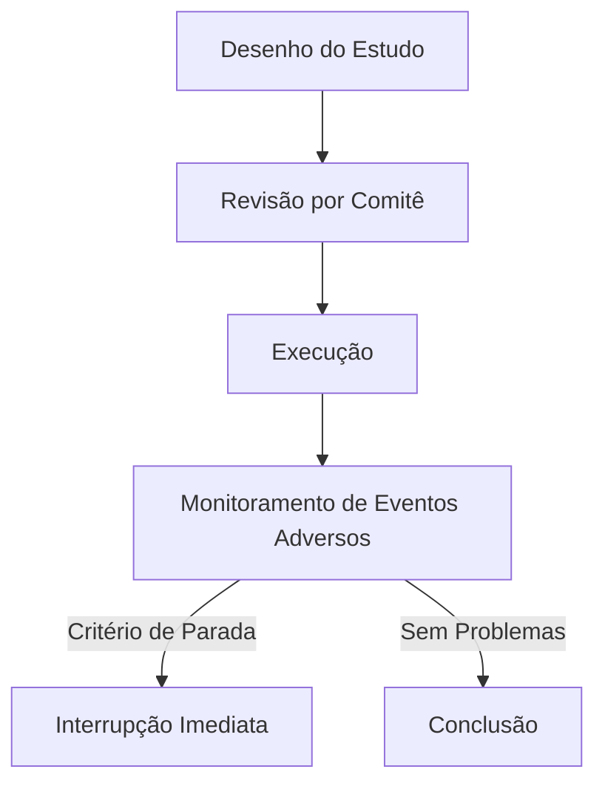

## Ética em Pesquisas Médicas

Um ensaio clínico testa um novo remédio para câncer em dois grupos: um recebe o medicamento experimental, o outro, placebo. Após seis meses, o grupo experimental mostra 30% mais sobrevivência. Parece um sucesso — até descobrirmos que os pacientes não sabiam que poderiam estar recebendo apenas açúcar comprimido. Esse cenário real (baseado no caso Tuskegee) expõe o núcleo da ética em pesquisas médicas: como equilibrar avanço científico e direitos humanos quando vidas estão em jogo.

### O Princípio da Não-Maleficência em Ação

O juramento hipocrático — "primeiro, não causar dano" — ganha contornos precisos na pesquisa médica. Considere este protocolo real rejeitado por um comitê de ética:

```python
# Pseudocódigo de um estudo problemático
def ensaio_clinico():
    pacientes = recrutar_pacientes_terminais()
    grupo_experimental = administrar_droga_nao_aprovada(pacientes[:50])
    grupo_controle = dar_placebo(pacientes[50:])
    return comparar_mortalidade(grupo_experimental, grupo_controle)
```

O erro aqui não é técnico (o método geraria dados válidos), mas ético: viola o princípio de não submeter seres humanos a riscos desnecessários. A correção exigiria:
1. Consentimento informado detalhado
2. Garantia de tratamento padrão para o grupo controle
3. Interrupção imediata se benefícios se tornarem evidentes

### O Dilema do Consentimento Informado

Um formulário de consentimento típico contém este trecho crítico:
> "Você compreende que pode ser alocado aleatoriamente para o grupo que não receberá o tratamento experimental?"

Em 2018, um estudo no *Journal of Medical Ethics* mostrou que 42% dos participantes não entendiam esse ponto fundamental. A solução não é mais texto, mas processos adaptativos:

```python
# Modelo de verificação de compreensão
def obter_consentimento():
    while True:
        explicar_procedimentos()
        teste_compreensao = aplicar_questionario()
        if teste_compreensao.pontuacao >= 90%:
            return assinar_termo()
        else:
            reexplicar_pontos_confusos()
```

### Justiça na Seleção de Participantes

Um banco de dados de ensaios clínicos revela um padrão preocupante: 78% dos estudos cardiovasculares entre 2015-2020 recrutaram predominantemente homens brancos. Isso gera dois problemas éticos:
1. Injustiça na distribuição de benefícios/riscos
2. Limitações na aplicabilidade dos resultados

A solução exige critérios explícitos de inclusão:

```markdown
| Critério          | Justificativa Ética               |
|-------------------|-----------------------------------|
| 30% mulheres       | Representatividade biológica      |
| 20% minorias       | Equidade no acesso a avanços      |
| 10% idosos (>75)   | Evitar discriminação por idade    |
```

### O Paradoxo da Pesquisa com Placebo

Quando um tratamento eficaz já existe, usar placebo gera um conflito ético direto. A Declaração de Helsinque (2013) estabelece que:
> "O benefício, riscos, ônus e eficácia de uma nova intervenção devem ser testados contra aqueles dos melhores métodos comprovados atuais."

Um estudo sobre antidepressivos violou essa regra em 2016, mantendo pacientes deprimidos sem tratamento por 12 semanas. O comitê de ética posteriormente determinou que o desenho correto deveria comparar a nova droga com a terapia padrão, não com placebo.

### Monitoramento Ético Contínuo

A ética não termina com a aprovação do estudo. Este fluxo mostra o processo ideal:



Em 2020, um ensaio de vacina contra HIV foi interrompido precocemente quando o monitoramento detectou 8 casos de reações autoimunes no grupo experimental — decisão que provavelmente salvou dezenas de participantes.

### Exercício Prático

Analise este cenário:
> "Pesquisadores propõem testar uma nova quimioterapia em crianças com leucemia, usando dose 20% maior que a adulta aprovada, justificando que metabolismo infantil é mais rápido."

**Questões:**
1. Quais princípios éticos estão em conflito?
2. Que salvaguardas seriam essenciais?

**Solução Comentada:**
1. Conflito entre benefício potencial (melhor eficácia) e risco (toxicidade desconhecida). Princípios envolvidos: não-maleficência vs. beneficência.
2. Salvaguardas mínimas:
   - Fase prévia em modelos animais pediátricos
   - Consentimento parental com linguagem adaptada
   - Dosagem progressiva (não começar com +20%)
   - Comitê de monitoramento independente