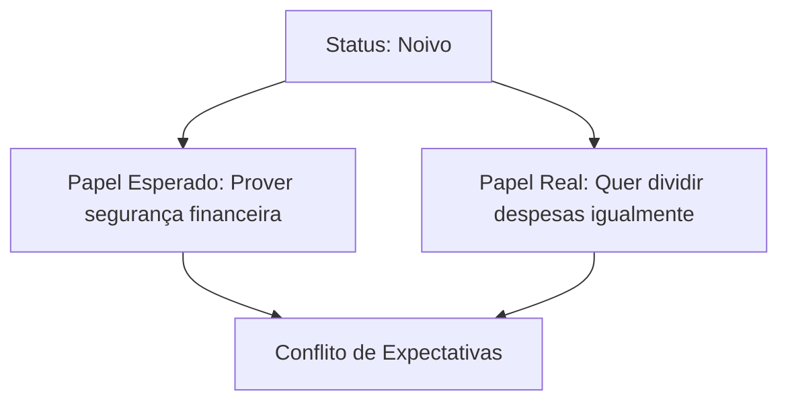

## Conceitos Básicos

Imagine que você está em um restaurante no Brasil e, ao receber a conta, divide igualmente o valor com os amigos. Em outro país, essa mesma ação poderia ser considerada grosseira. Por quê? A resposta está nos conceitos de **sociedade**, **cultura** e **normas sociais** — pilares que explicam por que nos relacionamos de formas específicas em diferentes contextos.

### Sociedade: O Tecido das Interações

Uma sociedade não é apenas um grupo de pessoas no mesmo lugar. É um sistema organizado de relações que se mantém ao longo do tempo, com padrões reconhecíveis. Por exemplo:

- **No casamento brasileiro**, espera-se que os noivos realizem uma grande festa. Isso não é lei, mas uma expectativa tão forte que quem não a cumpre precisa justificar sua decisão.
- **No divórcio**, a sociedade brasileira tende a ver a separação como um fracasso, enquanto na França a mesma situação pode ser encarada como uma mudança natural.

Um erro comum é confundir sociedade com comunidade. Veja a diferença:

```python
# Código conceitual (não executável)
sociedade = {
    "tipo": "sistema abrangente",
    "exemplo": "padrões de casamento no Brasil"
}

comunidade = {
    "tipo": "grupo localizado",
    "exemplo": "moradores de um bairro que organizam festas juninas"
}
```

### Cultura: O Manual Não Escrito

Cultura é o conjunto de conhecimentos, crenças e comportamentos compartilhados por um grupo. Ela opera como um "sistema operacional" invisível que diz como agir em relacionamentos:

1. **Cultura material**: Alianças de casamento, vestidos de noiva.
2. **Cultura imaterial**: A ideia de que o homem deve pedir a mulher em casamento.

Quando um brasileiro diz "isso não se faz", está apontando uma violação cultural. Por exemplo:

```
Cenário: Um homem não quer ter filhos após o casamento.
Resposta cultural típica no Brasil: "Mas é seu dever formar família!"
Resposta na Suécia: "É uma escolha pessoal válida."
```

### Normas Sociais: As Regras do Jogo

Normas são expectativas comportamentais. Elas variam em rigidez:

| Tipo de Norma | Exemplo no Casamento | Consequência da Quebra |
|---------------|----------------------|-------------------------|
| **Folkway** (informal) | Noivo não dançar na festa | Fofocas entre os convidados |
| **Mores** (moral) | Traição conjugal | Pressão para divórcio |
| **Lei** (formal) | Não registrar união estável | Sem direitos patrimoniais |

Um experimento simples mostra como as normas funcionam: tente chegar a um primeiro encontro de bermuda e chinelos no Brasil versus na Austrália. As reações diferentes revelam normas não ditas sobre apresentação pessoal em contextos românticos.

### Valores: O Que a Sociedade Considera Importante

Valores são crenças coletivas sobre o que é desejável. No Brasil, valores influenciam relacionamentos de formas específicas:

- **Família extensa**: Espera-se que o cônjuge participe de almoços dominicais com os sogros.
- **Jeitinho brasileiro**: A flexibilidade em regras pode afetar acordos pré-nupciais.

Compare com dados reais:

```python
valores_brasileiros = ["hospitalidade", "flexibilidade", "coletividade"]
valores_alemaes = ["pontualidade", "individualismo", "planejamento"]

def compatibilidade_conjugal(pais1, pais2):
    return len(set(valores_brasileiros) & set(valores_alemaes)) / 3  # Retorna 0.33 (baixa sobreposição)
```

### Status e Papéis: Quem é Quem no Relacionamento

Status é uma posição social (ex.: "esposa"), enquanto papel é o comportamento esperado para esse status. Um conflito comum:



Isso explica por que, mesmo em 2023, muitas brasileiras ainda esperam que o parceiro pague a conta no primeiro encontro — uma desconexão entre status modernos e papéis tradicionais.

### Exercício Prático

Analise este diálogo de um reality show de relacionamentos:

"Pedro, 32 anos, diz que não lavará louça porque 'isso é coisa de mulher'. Juliana, sua namorada, ameaça terminar."

1. Identifique:
   - A norma social desafiada (dica: procure por "isso é coisa de")
   - O valor em conflito (o que Juliana considera importante?)
   - Como o status de "namorado moderno" entra em conflito com papéis tradicionais

2. Solução comentada:
   - Norma: Divisão de tarefas domésticas por gênero (um "more" em transformação)
   - Valor: Igualdade de gênero (para Juliana) versus papéis tradicionais (para Pedro)
   - Status vs. Papel: Espera-se que um "namorado moderno" rejeite estereótipos, criando tensão com expectativas antigas

Este exercício mostra como conceitos básicos explicam conflitos reais em relacionamentos — ferramentas que usaremos para analisar casamentos e divórcios nos próximos capítulos.