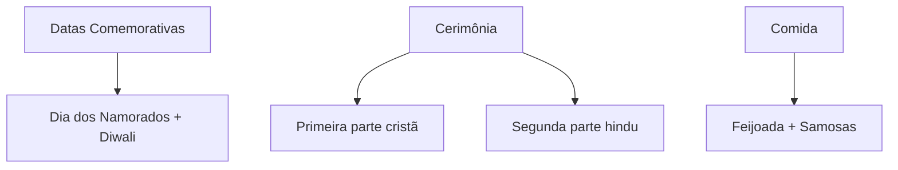

## Casamento e Cultura

No Brasil, um casamento tradicional começa com o noivo ajoelhado, de terno e gravata, em um restaurante caro, rodeado de amigos que filmam o momento no celular. A noiva, de vestido impecável, diz "sim" entre lágrimas. Esse ritual não surgiu por acaso - é o resultado de séculos de influência cultural que moldam como entendemos o que é um "casamento ideal".

### Como a cultura define o "certo" e o "errado" no casamento

Em 2019, uma pesquisa do IBGE mostrou que 72% dos brasileiros consideram essencial o casamento religioso, mesmo entre não praticantes. Por quê? A cultura opera como um manual não escrito que diz:

1. **Quando casar**: No Nordeste, é comum mulheres se casarem mais jovens (média de 24 anos) que no Sudeste (27 anos), refletindo valores regionais
2. **Com quem casar**: Até 1988, mulheres precisavam de autorização do marido para trabalhar - resquício cultural que ainda ecoa em famílias tradicionais
3. **Como casar**: A festa com 200 convidados, o bolo de 3 andares e a "lua de mel" em Porto Seguro são expectativas culturais, não necessidades reais

Um exemplo prático: quando João, de família mineira, quis um casamento simples no cartório com buffet de pão de queijo, sua futura sogra gaúcha insistiu em um churrasco para 150 pessoas. O conflito não era sobre comida, mas sobre qual tradição cultural prevaleceria.

### Os três níveis de influência cultural no casamento brasileiro

1. **Macrocultura (nacional)**:
   - A herança portuguesa trouxe o casamento católico como norma
   - O "jeitinho brasileiro" permite flexibilizar regras (como amasiar-se antes do casamento)
   - Exemplo: Mesmo com leis iguais, o Acre tem taxa de casamento 40% menor que o Ceará

2. **Mesocultura (regional)**:
   ```mermaid
   pie
       title Estilo de Casamento por Região (2022)
       "Sul: Tradicional gaúcho" : 35
       "Sudeste: Urbano/moderno" : 25
       "Nordeste: Religioso/extenso" : 30
       "Norte: Comunitário" : 10
   ```

3. **Microcultura (familiar)**:
   - Famílias italianas em São Paulo mantêm o costume da "serenata"
   - Descendentes de japoneses preservam o san-san-kudo (troca de cálices)
   - Casais evangélicos adotam a "entrega da noiva" com pastores

### Quando culturas entram em conflito

Mariana (carioca) e Raj (indiano) brigavam sempre que:
- Ela esperava presentes românticos no Dia dos Namorados (12/06)
- Ele priorizava o Diwali (festival hindu) para celebrar o relacionamento
- A família dela cobrava festa na igreja
- A família dele pedia cerimônia com fogo sagrado

Solução que encontraram:


### Exercício Prático

**Situação**: Carla (de família baiana) e Tiago (de família paulista) estão planejando o casamento. Ela quer uma festa com capoeira e acarajé. Ele prefere algo discreto no escritório do pai, com sushi. A mãe de Carla insiste em lista de presentes, a de Tiago acha brega.

**Tarefa**:
1. Liste 3 elementos culturais em conflito
2. Proponha um plano que incorpore ambas as culturas
3. Identifique qual tradição tem mais peso hoje no Brasil

**Solução Comentada**:

1. Conflitos culturais:
   - **Estilo de festa**: Comunitária (BA) vs. Privada (SP)
   - **Culinária**: Afro-brasileira vs. Japonesa
   - **Presentes**: Formalidade vs. Informalidade

2. Plano de integração:
   - Cerimônia íntima no escritório (agradando a família dele)
   - Recepção com roda de capoeira E bar de sushi fusion
   - Lista de presentes opcional via site, sem cobrança explícita

3. Tradição dominante:
   - A pesquisa Datafolha (2023) mostra que 68% dos casamentos urbanos ainda priorizam a tradição da noiva, refletindo o peso da cultura nordestina mesmo no Sudeste