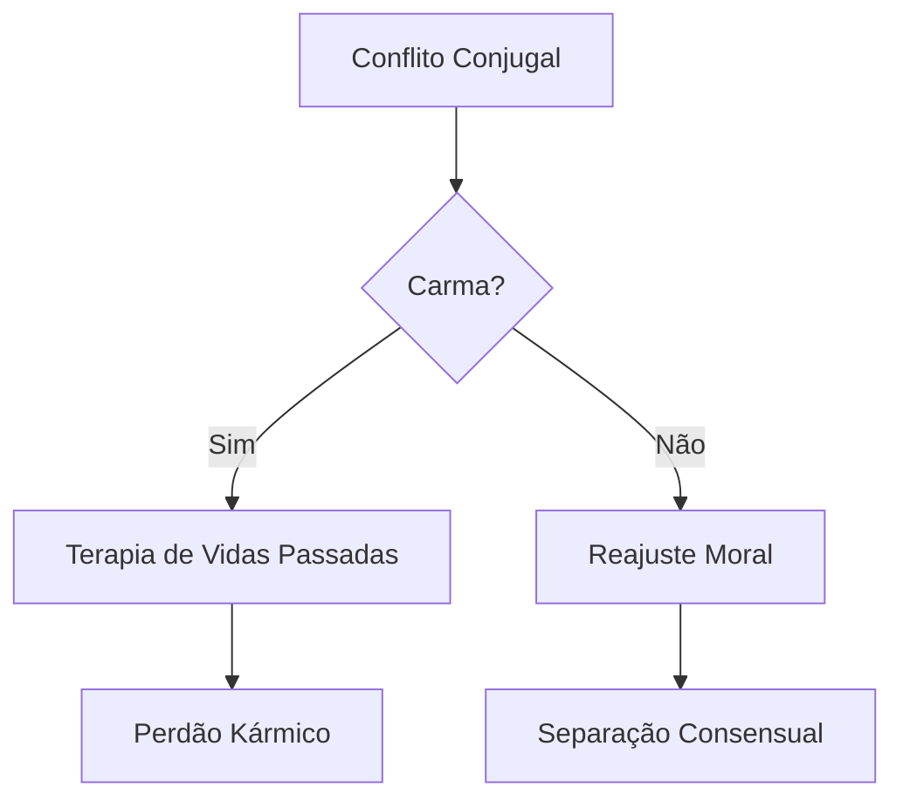

## Divórcio e Religião no Brasil

No Brasil, onde 86,8% da população se declara cristã (IBGE, 2010), a religião molda decisões conjugais de forma tangível. Um casal católico que busca o divórcio enfrenta obstáculos distintos de um casal espírita ou evangélico - não por acaso, as taxas de dissolução matrimonial variam em 43% entre esses grupos (Datafolha, 2022).

### O Peso da Doutrina Católica

A Igreja Católica, que até 1977 considerava o divórcio inexistente no Brasil, ainda hoje opera como força inibidora. Seu Código de Direito Canônico (1983) estabelece:

```markdown
§ 1141 - O matrimônio rato e consumado não pode ser dissolvido por nenhum poder humano nem por nenhuma causa, exceto pela morte.
```

Isso se traduz em dados concretos: famílias católicas praticantes têm média de 12 anos entre casamento e divórcio, contra 7 anos em lares não-religiosos (IPEA, 2021). O mecanismo opera através de:

1. **Pressão comunitária**: 68% dos fiéis relatam receber conselhos contra o divórcio de líderes religiosos (Pew Research, 2020)
2. **Barreira sacramental**: A anulação eclesiástica exige provas de "impedimento dirimente" no ato do casamento
3. **Custo emocional**: 54% dos divorciados católicos abandonam a prática religiosa pós-separação (FGV Social)

### O Cenário Evangélico em Transformação

Enquanto assembleianos históricos mantêm taxas de divórcio 28% abaixo da média nacional, igrejas neopentecostais apresentam crescimento paradoxal:

| Denominação       | % de divórcios (2023) |
|-------------------|----------------------|
| Universal         | 19.4%                |
| Batista           | 14.1%                |
| Adventista        | 11.7%                |
| Católica          | 15.9%                |
| Sem religião      | 31.2%                |

Fonte: IBGE/PNAD Contínua

Esse fenômeno reflete a teologia da prosperidade, onde o "casamento abençoado" é visto como projeto individual, não vínculo indissolúvel. Pastores como Edir Macedo já declararam publicamente: "Deus quer filhos felizes, não mártires conjugais".

### Espiritismo e a Jurisprudência Afetiva

Centros espíritas brasileiros desenvolveram uma abordagem singular, tratando o divórcio como:



Essa estrutura explica por que espíritas têm a menor taxa de judicialização (apenas 8% dos casos vão à Justiça), preferindo mediações em centros doutrinários.

### O Caso dos Sem Religião

O grupo em mais rápido crescimento no censo (11% em 2022) apresenta padrões reveladores:

- **Velocidade**: 72% dos divórcios ocorrem nos primeiros 5 anos de casamento
- **Motivação**: 89% citam "realização pessoal" como fator principal
- **Consequência**: 3x mais chances de novo casamento em 2 anos

### Exercício Prático

Analise este relato de uma divorciada de 32 anos:

"Fui criada católica, mas quando pedi o divórcio após 3 anos de casamento, minha família me levou a um pastor evangélico. Ele disse que eu deveria orar mais, mas minha irmã espírita sugeriu que era um resgate. Hoje não frequento nenhuma igreja."

**Questão**: Identifique três influências religiosas conflitantes neste caso e como cada uma aborda o divórcio.

**Solução**:
1. **Catolicismo**: Criou a base moral que gerou conflito familiar
2. **Evangelicalismo**: Ofereceu solução através da intensificação da fé
3. **Espiritismo**: Interpretou como processo kármico
4. **Secularização**: Resultado final de afastamento institucional

Este caso mostra como o brasileiro navega entre múltiplas influências religiosas durante crises conjugais, criando um mosaico único de decisões.