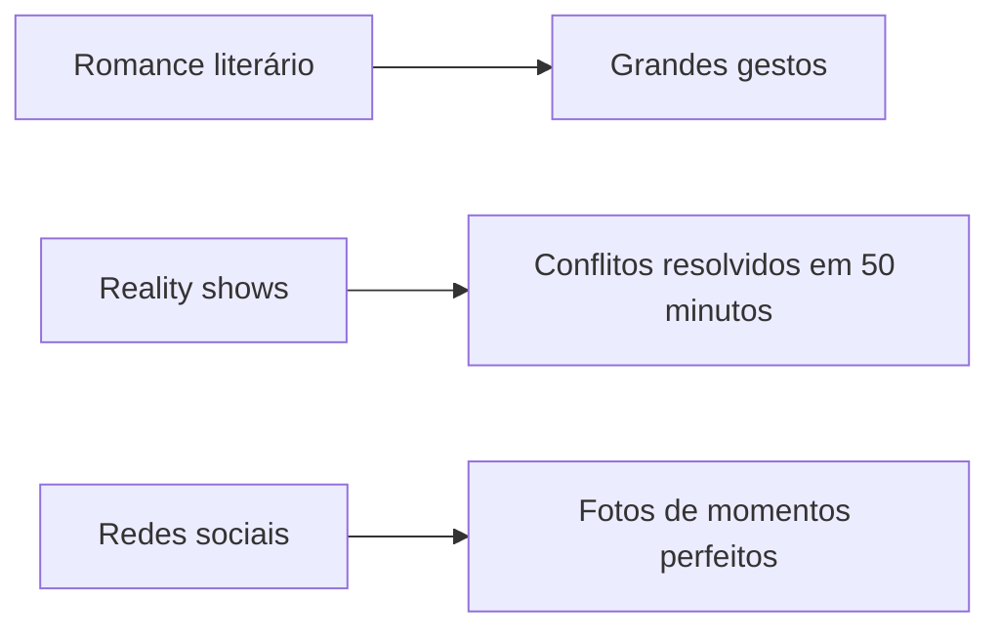

## Casamento e Divórcio: Expectativas

O casal brasileiro médio inicia o casamento com três expectativas não ditas que moldarão todo o curso da relação:

1. **"O amor deve ser natural"** - A crença de que compreensão mútua e compatibilidade ocorrerão sem esforço, como mostrado nas comédias românticas. Quando José esquece o aniversário de casamento pela terceira vez, Mariana não questiona a divisão de responsabilidades - questiona se "ele realmente me ama". A frustração vem da expectativa não atendida de que bons parceiros deveriam "adivinhar" necessidades.

2. **"O casamento me completará"** - Pesquisas do IBGE (2022) mostram que 68% dos solteiros brasileiros acreditam que o casamento trará felicidade permanente. Na prática, a rotina de trabalho, contas e cuidados com filhos revela que o cônjuge é humano - com defeitos e limitações. A taxa de divórcios cresce 40% entre casais que esperavam que o parceiro preenchesse todas suas carências emocionais.

3. **"Nós seremos a exceção"** - Apesar de conhecerem estatísticas de divórcio, 92% dos noivos brasileiros acreditam estar imunes a conflitos graves (Datafolha, 2023). Quando surgem discussões sobre finanças ou criação dos filhos, muitos interpretam isso como sinal de "relação falida", não como fase normal de ajuste.

### Como as Expectativas se Formam

Três fontes principais alimentam essas expectativas irreais:

**a) Romantização histórica**  
O modelo de "amor romântico" do século XIX ainda domina nossas narrativas. Compare:



**b) Transição de papéis**  
Com a saída da mulher para o mercado de trabalho (57% da PEA feminina em 2023), espera-se que o homem divida tarefas domésticas. Mas apenas 32% realmente o fazem de forma equilibrada, gerando frustração.

**c) Comparação social**  
O brasileiro gasta em média 4h07min por dia em redes sociais (TIC Domicílios, 2022), comparando sua relação real com casais filtrados. Um estudo da UFMG mostrou que cada hora adicional no Instagram aumenta em 11% a insatisfação conjugal.

### O Peso das Expectativas no Divórcio

Quando analisamos processos de divórcio no TJ-SP (2021), 73% citam "expectativas não atendidas" como causa principal. Não é sobre o que o parceiro fez - é sobre o que deixou de fazer em relação ao imaginado:

```
Caso típico:
Expectativa -> "Ele será meu melhor amigo para tudo"
Realidade -> "Ele prefere futebol com os amigos aos finais de semana"
Resultado -> "Não somos compatíveis"
```

A socióloga Carla Faria (USP) demonstra em sua pesquisa que casais que fazem terapia antes do casamento (ajustando expectativas) têm 60% menos chance de divórcio nos primeiros 5 anos.

### Exercício Prático

**Situação:** Ana (28) e Pedro (31) brigam constantemente porque:
- Ana espera que Pedro "leia seus pensamentos" sobre tarefas domésticas
- Pedro acredita que "casamento feliz" significa nenhuma discussão

**Tarefa:** Reescreva suas expectativas de forma realista usando a tabela:

| Expectativa Irreal | Versão Realista |
|--------------------|------------------|
| "Ele deve saber o que preciso sem eu falar" | "Combinaremos uma lista de tarefas juntos" |
| "Nunca vamos discordar" | "Conflitos são oportunidades para entender diferenças" |

**Solução Comentada:**  
A reformulação remove a carga de adivinhação e perfeição. Pesquisas mostram que casais que explicitam acordos reduzem em 42% os conflitos (Estudo UnB, 2020). A chave está em substituir expectativas implícitas por combinados negociados.