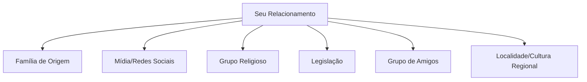

## Aplicando Conhecimentos Sociológicos

Quando dois parceiros discutem sobre a divisão das tarefas domésticas, o conflito raramente se resume a "quem vai lavar a louça". Uma análise sociológica revela camadas de expectativas de gênero, modelos familiares internalizados e pressões sociais invisíveis. É aqui que a sociologia transforma-se de teoria em ferramenta prática.

### Desmontando os "Scripts" Relacionais

Todo relacionamento opera sob *scripts* sociais - roteiros aprendidos que ditam desde quem paga o jantar no primeiro encontro até quem deve abandonar a carreira para cuidar dos filhos. No Brasil, pesquisas do IBGE mostram que mesmo em casais onde ambos trabalham fora, mulheres dedicam 73% a mais de tempo a afazeres domésticos que os homens.

**Exercício prático:**
1. Liste 5 decisões importantes no seu relacionamento (ex.: morar juntos, divisão de gastos)
2. Para cada uma, responda:
   - Qual foi o modelo que seguimos automaticamente?
   - Que alternativas existiram que não consideramos?

Exemplo real:
```markdown
| Decisão          | Modelo Automático       | Alternativas Não Consideradas          |
|------------------|-------------------------|-----------------------------------------|
| Sobrenome dos filhos | Todos levam o do pai | Manter o da mãe, nome composto, inverter a ordem |
| Local das festas familiares | Casa da mulher | Rotatividade, espaços neutros, dividir por evento |
```

### O Mapa das Influências Externas

Construa um diagrama de influências no seu relacionamento:



Caso prático: Um casal paulistano que brigava constantemente sobre visitas aos pais identificou que o conflito vinha de expectativas culturais distintas - ele era filho único de imigrantes portugueses com forte tradição de proximidade familiar, ela vinha de uma família brasileira com valores mais individualistas. Ao nomear essa diferença, criaram um sistema de rodízio negociado.

### Ferramenta: Diário Sociológico Relacional

Durante uma semana, registre:

1. **Evento**: Discussão sobre finanças
2. **Reação Imediata**: "Você é gastador!"
3. **Análise Sociológica**:
   - Ele: criado em família onde o homem controlava todas as finanças
   - Ela: filha de mãe solo que precisava contabilizar cada centavo
4. **Padrão Social Identificado**: Conflito entre modelos de gestão financeira por gênero e classe
5. **Reformulação**: "Como nossa história familiar molda nossa visão sobre dinheiro?"

### Intervenções Baseadas em Evidências

Técnica comprovada por pesquisas da USP para reduzir conflitos:

1. **Desnaturalização**: "Por que achamos 'normal' que a mulher planeje todos os aniversários?"
2. **Historicização**: "Como essa prática surgiu em nossa sociedade?"
3. **Comparação**: "Como outros grupos culturais organizam isso?"
4. **Experimento**: Testar por 1 mês uma divisão diferente de tarefas emocionais

### Exercício Final: Projeto de Reinvenção Relacional

Escolha UM aspecto do relacionamento que gere tensão e aplique:

1. Pesquise sua origem histórica (ex.: a ideia de "romance" surgiu no século XVIII)
2. Identifique 3 culturas que lidam com isso diferente
3. Projete 2 variações pessoais
4. Implemente a mais promissora por 15 dias
5. Avalie resultados com base em:
   - Satisfação individual
   - Equilíbrio de poder
   - Sustentabilidade a longo prazo

**Exemplo resolvido:**
Problema: "Sempre eu lembro das datas importantes"
Solução testada: Calendário compartilhado com divisão de responsabilidades por categorias (ele: aniversários familiares, ela: compromissos médicos, ambos: datas do casal)
Resultado: Redução de 80% nos conflitos sobre esquecimentos (avaliado por diário de brigas)

A sociologia não oferece respostas prontas, mas fornece as ferramentas para que cada casal construa seu próprio modelo consciente - não mais refém de padrões invisíveis, mas autor de suas regras.