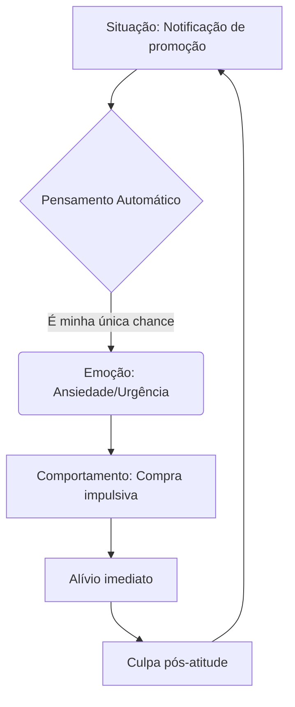

## Vignette Clínica: Autocontrole/Disciplina Insuficientes

Marina, 34 anos, chega à consulta reclamando de "crises de compulsão" que afetam sua vida financeira e profissional. Nos últimos três meses, gastou R$ 8.000 em compras online de itens não essenciais, mesmo com um salário de R$ 4.500. Seu cartão de crédito está no limite, e ela já atrasou o aluguel duas vezes para pagar dívidas de jogos mobile. "Sei que é errado, mas quando a vontade vem, é como se eu desligasse o juízo", descreve, chorando.

O histórico revela um padrão crônico:
- Na faculdade, abandonou dois cursos após meses de procrastinação ("deixava tudo para a véspera até que não dava mais").
- Já foi demitida por acumular atrasos e não entregar relatórios no prazo.
- Tem 17 aplicativos de dieta instalados no celular, mas nunca segue nenhum por mais de 4 dias.
- Relata brigas frequentes com o namorado por "prometer e não cumprir" combinados domésticos.

Durante a avaliação, Marina demonstra insight ("Eu me sabotoo") mas impotência ("Não consigo me controlar"). Um diálogo típico:

**Terapeuta**: "O que aconteceu na semana passada, quando você prometeu não comprar mais roupas?"
**Marina**: "Passei na frente da loja e vi uma promoção... Aí pensei 'só vou olhar'. Duas horas depois, tinha gastado R$ 700. Quando vi o extrato no dia seguinte, fiquei envergonhada e escondi as sacolas no armário."

Os gatilhos identificados incluem:
1. **Estresse laboral** (compras como alívio imediato)
2. **Tédio** (jogos como estimulação)
3. **Frustrações cotidianas** (descontar em comida)

Padrão cognitivo observado:

Comparando com o esquema de Direito/Grandiosidade (visto anteriormente), enquanto Lucas (caso anterior) agia por senso de merecimento ("Eu mereço isso"), Marina age por **falta de barreira inibitória** - sabe que não deveria, mas não consegue frear o impulso.

O prejuízo social fica evidente quando ela relata: "Minha irmã não me empresta mais dinheiro desde que gastei tudo em apostas". No trabalho, colegas reclamam que "ela sempre diz sim aos projetos, mas some nas entregas".

**Exercício Prático**  
Identifique no seu dia a dia uma situação onde:
1. Você adiou uma tarefa importante sem motivo real
2. Comprou algo por impulso que depois se arrependeu
3. Comeu além do planejado por não resistir à tentação

Anote:  
- Qual foi o gatilho inicial?  
- O que você pensou no momento?  
- Como se sentiu após a ação?  

*Solução comentada*:  
Um exemplo comum é procrastinar um relatório até o último dia. O gatilho pode ser o cansaço ("Vou começar amanhã"), o pensamento é de subestimação do tempo ("Isso é rápido"), e a emoção posterior é culpa ("Por que não comecei antes?"). Observe padrões repetitivos - são pistas para identificar o esquema em ação.