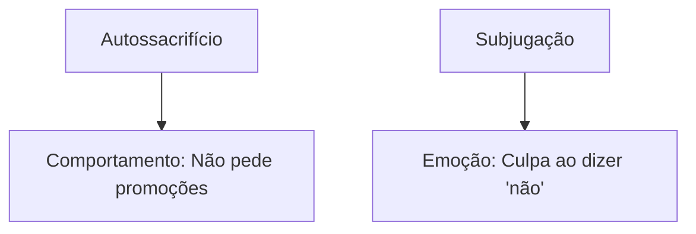

## Análise de Caso Fictício: Mapa de Esquemas

**Caso "Ana" - 32 anos, relata:**  
*"Sempre me sinto inadequada no trabalho, mesmo quando recebo elogios. Se um colega faz uma crítica, fico obcecada por dias. Meus relacionamentos são marcados por ciúmes - checo o celular do meu parceiro e exijo provas de amor constantemente. Quando discuto com alguém, tenho a sensação de que vou ser abandonada. Cresci com pais muito críticos e um irmão que era o 'filho perfeito'."*

### Passo 1: Identificação dos Esquemas (Baseado no YSQ e História de Vida)  
1. **Defeito/Verifica** (Domínio 1):  
   - *Evidências:* Autopercepção de "nunca ser boa o suficiente", hipersensibilidade a críticas.  
   - *História de vida:* Pais comparavam-na constantemente com o irmão.  

2. **Abandono** (Domínio 1):  
   - *Evidências:* Medo excessivo de perder o parceiro, comportamentos de "clinginess".  
   - *História de vida:* Pais eram emocionalmente instáveis.  

3. **Padrões Inalcançáveis** (Domínio 2):  
   - *Evidências:* Perfeccionismo no trabalho, desvalorização de próprias conquistas.  

### Passo 2: Mapa Visual dos Esquemas  
```mermaid  
graph TD  
    A[Esquema: Defeito/Verifica] --> B[Pensamento: "Sou fraudulenta"]  
    A --> C[Comportamento: Evita desafios]  
    D[Esquema: Abandono] --> E[Emoção: Ansiedade]  
    D --> F[Comportamento: Ciúmes]  
    G[Esquema: Padrões Inalcançáveis] --> H[Pensamento: "Meu trabalho nunca está bom"]  
```  

### Passo 3: Conexão com Necessidades Não Atendidas  
| Esquema         | Necessidade Básica Frustrada |  
|-----------------|------------------------------|  
| Defeito/Verifica | Aceitação incondicional      |  
| Abandono        | Segurança emocional          |  

**Erro comum:** Confundir *Abandono* com *Dependência* (este último envolve dificuldade em tomar decisões sozinho). Ana não tem dificuldades de autonomia, mas sim medo de perda.  

### Exercício Prático  
**Caso "Carlos" - 40 anos:**  
*"Sempre cuidei da minha mãe doente, mesmo quando isso me prejudicava. Hoje, me sinto culpado quando priorizo minhas necessidades. No trabalho, evito pedir promoções para não 'sobrecarregar' meus superiores."*  

1. Identifique 2 esquemas prováveis (Domínio 4: Orientação para o Outro)  
2. Desenhe um mapa simples ligando esquemas a um comportamento descrito  

**Solução Comentada:**  
1. **Autossacrifício** (prioriza necessidades alheias de forma crônica) e **Subjugação** (evita conflitos por medo de consequências).  
2. Mapa exemplo:  
