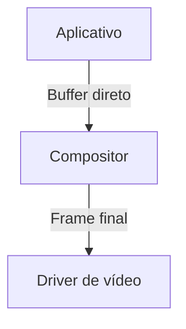

## O que é Wayland?

Wayland é um protocolo moderno para sistemas gráficos no Linux, desenhado para substituir o antigo X11 (X Window System). A maneira mais prática de entender o Wayland é comparando-o com algo que todo usuário Linux conhece: o sistema de janelas tradicional.

No X11, quando você move uma janela, o que acontece por baixo dos panos? O servidor X precisa:
1. Receber o comando do mouse
2. Calcular a nova posição
3. Redesenhar a janela inteira
4. Coordenar com o gerenciador de janelas
5. Enviar para o driver de vídeo

Isso gera complexidade e latência. Veja um exemplo concreto com o comando `xwininfo` (que não funciona no Wayland, justamente por essa diferença arquitetural):

```bash
xwininfo -root | grep Width
```
Saída típica no X11:
```
  Width: 1920
```

O Wayland inverte essa lógica. Em vez de um servidor central que faz tudo, cada aplicativo (cliente) é responsável por desenhar seu próprio conteúdo. O compositor (equivalente ao gerenciador de janelas no X11) só coordena:



Quando você arrasta uma janela no Wayland, só o aplicativo em questão redesenha seu conteúdo. Isso elimina camadas desnecessárias. Para ver o protocolo em ação, instale `weston` (uma implementação de referência):

```bash
sudo apt install weston
weston --log=/tmp/wayland.log
```

Abra outro terminal e verifique o log:
```bash
tail -f /tmp/wayland.log | grep "new surface"
```
Saída ao abrir uma janela:
```
[12:34:56] New surface created (id=42) by client: gnome-terminal
```

Os erros comuns ao migrar para o Wayland geralmente aparecem assim:
```
Error: Unable to open display (X11)
```
Isso ocorre quando aplicativos X11 tentam rodar diretamente no Wayland. A solução é usar `xwayland` (ponte de compatibilidade), ativado automaticamente na maioria das distribuições.

Para verificar se você está usando Wayland:
```bash
echo $XDG_SESSION_TYPE
```
Saída esperada:
```
wayland
```

Se aparecer "x11", seu ambiente ainda usa o sistema antigo. Distribuições modernas como Fedora e Ubuntu 22.04+ já usam Wayland por padrão.

**Exercício**: Crie um aplicativo mínimo que exibe uma janela vazia usando a biblioteca `wayland-client`. Instale as dependências:
```bash
sudo apt install libwayland-dev wayland-protocols
```

Solução (arquivo `minimal.c`):
```c
#include <wayland-client.h>

int main() {
    struct wl_display *display = wl_display_connect(NULL);
    if (!display) {
        fprintf(stderr, "Failed to connect to Wayland display\n");
        return 1;
    }
    printf("Connected to Wayland display!\n");
    wl_display_disconnect(display);
    return 0;
}
```
Compile e execute:
```bash
gcc minimal.c -lwayland-client -o minimal
./minimal
```
Saída esperada:
```
Connected to Wayland display!
```