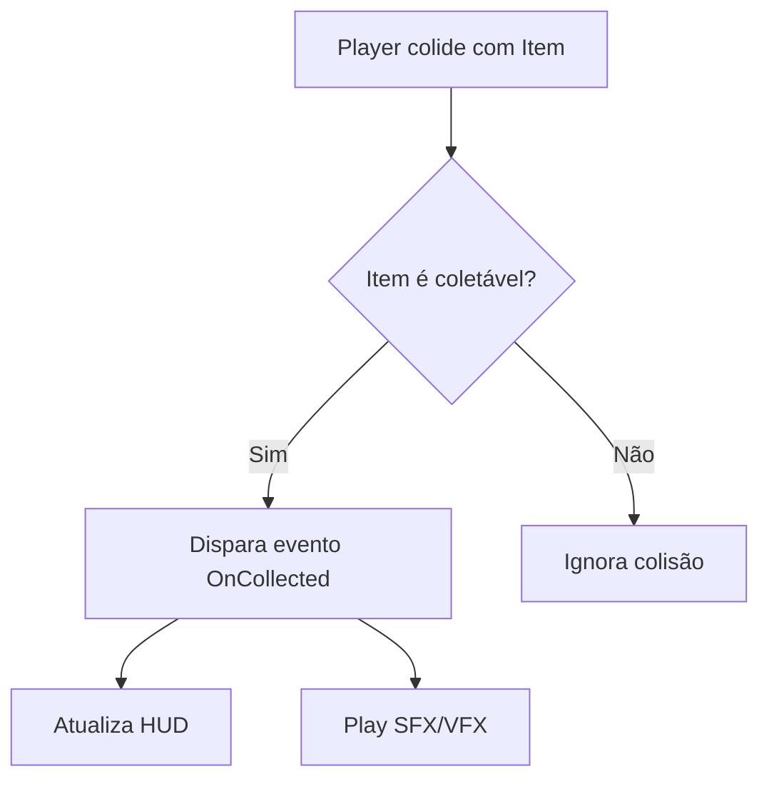

## Documentação do projeto

Você acabou de implementar um sistema de combate complexo no seu jogo, com animações, efeitos sonoros e feedback visual. Três meses depois, ao tentar adicionar um novo tipo de ataque, descobre que não consegue lembrar como os danos são calculados ou qual classe controla o cooldown. Esse é o problema que a documentação resolve - e no desenvolvimento profissional, ela é tão crucial quanto o código em si.

A Unreal Engine oferece três formas principais de documentação integrada ao projeto:

1. **Comentários de código** - o nível mais granular, para explicar trechos complexos:

```cpp
// Calcula dano com base no nível do personagem e no multiplicador de arma
// Fórmula: (AtaqueBase + DanoArma) * (1 + Nível * 0.05)
float ACalculateDamage(float BaseAttack, float WeaponDamage, int32 Level) 
{
    return (BaseAttack + WeaponDamage) * (1 + Level * 0.05f); 
}
```

2. **Documentação Doxygen** - padrão da indústria para gerar docs automatizadas:

```cpp
/**
 * @class AEnemyAI
 * @brief Controla comportamento de inimigos com máquina de estados finitos
 * 
 * Estados possíveis:
 * - Patrulha: Movimentação entre waypoints
 * - Perseguição: Segue jogador quando avistado
 * - Ataque: Executa padrão de combate
 */
UCLASS()
class MYGAME_API AEnemyAI : public AActor
{
    GENERATED_BODY()
    
    /** Raio de visão do inimigo em centímetros */
    UPROPERTY(EditDefaultsOnly, Category="AI")
    float VisionRadius = 1000.0f;
};
```

3. **Arquivos .md no diretório Docs/** - para documentação de alto nível:

```markdown
# Sistema de Combate

## Fluxo Principal
1. Player pressiona botão de ataque
2. GameplayAbilitySystem verifica cooldown
3. AnimMontage é disparado
4. OnMontageEnded aplica dano via trace

## Classes Envolvidas
- `ACombatManager`: Orquestra todos os combates
- `UCombatComponent`: Interface para personagens
- `FCombatDataTable`: Dados de armas/ataques
```

**Erro comum:** Documentação desatualizada. Se você alterar a fórmula de dano mas não atualizar o comentário, pior do que não ter documentação. A Unreal ajuda com:

```cpp
// Atualize este comentário quando modificar a fórmula!
UFUNCTION(BlueprintCallable, Category="Combat", meta=(Tooltip="Calcula dano baseado em nível"))
float CalculateDamage(float BaseAttack, float WeaponDamage, int32 Level);
```

Para garantir que todos sigam o padrão, crie um arquivo `DocumentationStyle.md`:

```markdown
# Padrão de Documentação

## Comentários
- Sempre explique o "porquê", não o "como"
- Use // para comentários de linha única
- Use /* */ para blocos acima de 3 linhas

## Doxygen
- @brief obrigatório para classes/métodos públicos
- @param para todos os parâmetros não óbvios
- @return quando o retorno não é autoexplicativo

## Exemplo Ruim vs Bom
❌ "Incrementa o contador"  
✅ "Incrementa quando o jogador coleta power-up para rastrear bonus ativo"
```

**Exercício:** Documente o sistema de coleta de itens do seu jogo com:
1. Comentários explicando a lógica de spawn
2. Documentação Doxygen para a classe principal
3. Arquivo markdown com fluxograma do sistema

**Solução comentada:**

```cpp
// InventorySystem.h
/**
 * @class AItemSpawner
 * @brief Controla geração de itens colecionáveis no mapa
 * 
 * Usa object pooling para performance, com:
 * - Spawn aleatório em locais válidos
 * - Respawn após coleta baseado em timer
 */
UCLASS()
class MYGAME_API AItemSpawner : public AActor
{
    /** Raio de verificação para evitar spawn em paredes */
    UPROPERTY(EditAnywhere, meta=(Tooltip="Distância mínima de obstáculos"))
    float SpawnRadiusCheck = 50.0f;
};
```

```markdown
# Docs/InventorySystem.md

## Fluxo de Coleta
